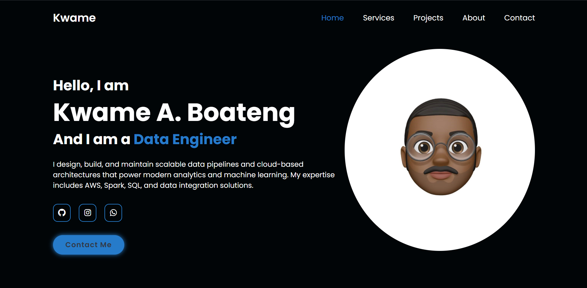

# Kwame A. Boateng - Data Engineer Portfolio

This repository contains the source code for my personal **Data Engineer Portfolio Website**.  
It showcases my professional background, technical skills, projects, and services.  
The site is built using **HTML, CSS, and Boxicons** for a clean and responsive design.

---


## Live Preview

[View Portfolio](#)  
_(Replace `#` with your hosted URL when deployed to GitHub Pages, Netlify, or Vercel.)_

---

## Project Structure

```
.
├── index.html         # Main homepage
├── about.html         # About Me page
├── Services.html      # Services page
├── projects.html      # Projects page
├── style.css          # Global styling
├── script.js          # JavaScript for menu toggle and animations
└── Images/            # All images (profile, service icons, etc.)
```

---

## Features

- **Home Page:** Introduction, social media links (GitHub, Instagram, WhatsApp).
- **About Page:** Profile section, career journey timeline, and core skills.
- **Services Page:** List of professional data engineering services.
- **Projects Page:** Showcases key data engineering projects with GitHub links.
- **Responsive Design:** Works well on desktops, tablets, and mobile devices.
- **Icons:** Uses [Boxicons](https://boxicons.com/) for lightweight vector icons.
- **Contact Links:** WhatsApp integration for quick communication.

---

## Technologies Used

- **HTML5** – Semantic structure
- **CSS3** – Styling and layout
- **Boxicons** – Icon library
- **JavaScript** – Navigation menu toggle (if implemented in `script.js`)
- **Responsive Web Design** – Flexbox & Grid

---

## Getting Started

### 1. Clone this repository

```bash
git clone https://github.com/<your-username>/<repo-name>.git
```

### 2. Open in a browser

Simply open `index.html` in your web browser.

### 3. Edit Content

- Update **images** inside the `Images/` folder.
- Change **links** (GitHub, LinkedIn, WhatsApp) to your actual profiles.
- Adjust **colors and fonts** in `style.css`.

---

## Screenshots

_(Add screenshots of each page here for clarity)_

---

## Future Improvements

- Add smooth scrolling and animations.
- Implement a contact form with email integration.
- Convert to a React or Next.js version for scalability.
- Add blog or articles section.

---

## Contact

**Kwame A. Boateng**

- GitHub: [Kwame842](https://github.com/Kwame842)
- LinkedIn: [kwame-boateng01](https://www.linkedin.com/in/********/)
- WhatsApp: [Chat Now](https://wa.me/qr/**********)

---

© 2024 Kwame Tech | All Rights Reserved
